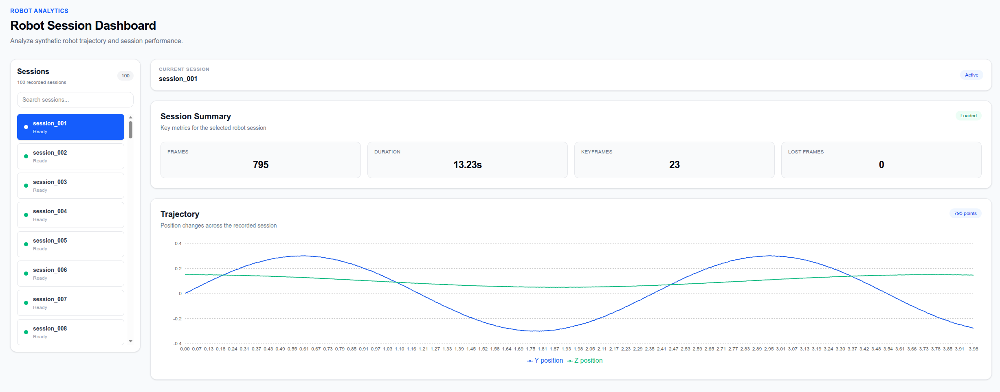

# 🤖 Robot Session Dashboard

> **FastAPI와 Next.js를 활용하여 로봇 세션 데이터를 시각화하는 대시보드입니다.**

Session 목록 조회, 세션 요약 정보(Summary), Trajectory 시각화를 통해
로봇의 동작 데이터를 한눈에 확인할 수 있습니다.

---

## 🚀 Demo

> 배포 후 링크 추가 예정

- Frontend:
- Backend:

---

## 📷 Preview

> 스크린샷 추가 예정

---

# ✨ Features

- Session 목록 조회
- Session 검색
- 현재 선택된 Session 표시
- Summary 데이터 조회
- Trajectory 시각화(Line Chart)
- FastAPI REST API 연동
- React State Lifting을 활용한 컴포넌트 상태 관리

---

# 🛠 Tech Stack

## Frontend

- Next.js
- React
- TypeScript
- Tailwind CSS
- Recharts

## Backend

- FastAPI
- Python

---

# 📂 Project Structure

```
frontend
├── app
├── components
│   ├── DashboardClient.tsx
│   ├── SessionList.tsx
│   ├── SummaryCard.tsx
│   └── TrajectoryChart.tsx

backend
├── main.py
├── generate_synthetic_sessions.py
└── metadata
```

---

# 📌 API

## Get Sessions

```
GET /sessions
```

Response

```json
[
  {
    "id": "session_001",
    "has_metadata": true
  }
]
```

---

## Get Session Summary

```
GET /sessions/{session_id}/summary
```

Response

```json
{
  "frames": 1775,
  "duration_sec": 29.57,
  "keyframes": 71,
  "lost_frames": 0
}
```

---

## Get Trajectory

```
GET /sessions/{session_id}/trajectory
```

Response

```json
{
  "points": [
    {
      "x": 0.0,
      "y": 0.15,
      "z": 0.02
    }
  ]
}
```

---

# 💡 Implementation

### Session Selection

- SessionList에서 선택한 Session을 DashboardClient가 관리
- 선택된 Session이 변경되면 Summary와 Trajectory를 다시 요청

### Summary

- FastAPI에서 metadata.json을 읽어 Summary 데이터를 반환
- 선택된 Session에 따라 화면이 실시간 갱신

### Trajectory

- Trajectory 데이터를 REST API로 조회
- Recharts를 이용하여 Y/Z Position을 Line Chart로 시각화

---

# 📸 Screenshots

## Dashboard



---

# 🔧 Installation

## Backend

```bash
cd backend

pip install -r requirements.txt

uvicorn main:app --reload
```

---

## Frontend

```bash
cd frontend

npm install

npm run dev
```

---

# 🎯 Future Improvements

- AI Insight 기능 추가
- Trajectory 분석 기능
- Session Filtering 기능 강화
- 실제 Robot Dataset 연동
- Dashboard 배포(Vercel / Render)
